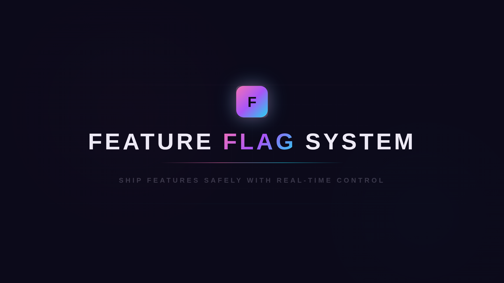

# Feature Flag System

[](https://go.dev/)
[](https://www.typescriptlang.org/)
[](https://www.postgresql.org/)
[](https://redis.io/)
[](https://www.docker.com/)
[](LICENSE)

A self-hosted feature flag platform with percentage rollouts, targeted user access, and real-time propagation — from API to dashboard to client SDK.

---

## Demo



> **Click the image above to watch the demo** — a 2-minute walkthrough covering flag creation, percentage rollouts, real-time toggling, and the demo app showing per-user evaluation across different rollout rules.

---

## Why This Exists

Commercial feature flag services like LaunchDarkly and Flagsmith solve a real problem, but they're expensive at scale and their evaluation logic is a black box. This project is a self-hosted, fully transparent alternative built from scratch — every layer from the hashing algorithm to the SSE broker is visible and auditable. It also served as a deep dive into building real-time distributed systems with Go, PostgreSQL, and Redis.

---

## Architecture

```
                        ┌─────────────────────────────────────────────┐
                        │              Go API Server (:8080)          │
                        │                                             │
                        │   ┌───────────┐  ┌───────────┐  ┌───────┐  │
                        │   │ Handlers  │  │  Service   │  │  SSE  │  │
                        │   │ (Chi)     │──│  Layer     │──│ Broker│  │
                        │   └───────────┘  └─────┬─────┘  └───┬───┘  │
                        │                        │             │      │
                        └────────────────────────┼─────────────┼──────┘
                              ▲       ▲          │             │
                    REST API  │       │  SSE     │             │
                              │       │ Stream   ▼             ▼
               ┌──────────────┴──┐    │    ┌──────────┐  ┌──────────┐
               │  Next.js        │    │    │PostgreSQL│  │  Redis   │
               │  Dashboard      │◄───┘    │          │  │          │
               │  (:3000)        │         │  Flag    │  │ Pub/Sub  │
               └─────────────────┘         │  Storage │  │  Cache   │
                                           └──────────┘  └──────────┘
               ┌─────────────────┐              ▲              ▲
               │  Client SDK     │              │              │
               │  (TypeScript)   │──REST API──► │   ◄──────────┘
               │                 │◄──SSE──────  │
               └─────────────────┘              │
```

---

## Key Features

- **Boolean and percentage-based rollouts** — Flags support simple on/off toggles or gradual rollouts using deterministic FNV-1a hashing, so the same user always gets a consistent result for a given flag.
- **Targeted user overrides** — Enable a feature for specific user IDs regardless of the rollout percentage, useful for internal testing or beta access.
- **Real-time flag updates via SSE** — Flag changes propagate instantly to all connected clients through Server-Sent Events. No polling, no stale state.
- **Admin dashboard** — Create, edit, toggle, and delete flags from a responsive UI built with Next.js, React Query, and shadcn/ui.
- **Client SDK with local evaluation** — A TypeScript SDK fetches flag configs once, evaluates rules locally (zero network latency per check), and stays in sync via SSE.
- **Docker Compose one-command setup** — `docker compose up` starts the entire stack: Go server, Next.js frontend, PostgreSQL, and Redis.

---

## Tech Stack

| Layer          | Technology                                          |
|----------------|-----------------------------------------------------|
| API Server     | Go 1.22, Chi router, net/http SSE                   |
| Database       | PostgreSQL 16 (pgx driver, UUID primary keys)       |
| Cache / Pub-Sub| Redis 7 (go-redis, `flag_updates` channel)          |
| Frontend       | Next.js 16, React 19, TypeScript 5                  |
| UI Components  | shadcn/ui, TailwindCSS v4, Framer Motion            |
| State          | React Query v5 (cache invalidation via SSE)         |
| Client SDK     | TypeScript (FNV-1a hashing, EventSource)             |
| Infrastructure | Docker, Docker Compose                               |

---

## Getting Started

### Prerequisites

- [Docker](https://docs.docker.com/get-docker/) and Docker Compose
- (Optional) Go 1.22+ and Node.js 20+ for local development

### Run the full stack

```bash
git clone https://github.com/kripa-sindhu-007/feature-flag-system.git
cd feature-flag-system
docker compose up --build
```

| Service    | URL                          |
|------------|------------------------------|
| Dashboard  | http://localhost:3000         |
| API Server | http://localhost:8080         |
| PostgreSQL | localhost:5432               |
| Redis      | localhost:6379               |

### Create your first flag

```bash
curl -X POST http://localhost:8080/api/admin/flags \
  -H "Content-Type: application/json" \
  -H "X-Admin-API-Key: admin-secret-key" \
  -d '{
    "key": "new-checkout-flow",
    "description": "Redesigned checkout experience",
    "enabled": true,
    "rollout_percentage": 25,
    "targeted_users": ["user-1", "user-3"]
  }'
```

Open the dashboard at `http://localhost:3000` to see the flag appear in real time.

---

## API Reference

All admin endpoints require the `X-Admin-API-Key` header. Client endpoints require `X-SDK-Key` (or `?key=` query param for SSE).

### Admin Endpoints

| Method   | Endpoint                       | Description               |
|----------|--------------------------------|---------------------------|
| `POST`   | `/api/admin/flags`             | Create a new flag         |
| `GET`    | `/api/admin/flags`             | List all flags            |
| `GET`    | `/api/admin/flags/{id}`        | Get a flag by ID          |
| `PUT`    | `/api/admin/flags/{id}`        | Update a flag             |
| `DELETE` | `/api/admin/flags/{id}`        | Delete a flag             |
| `PATCH`  | `/api/admin/flags/{id}/toggle` | Toggle a flag on or off   |

### Client Endpoints

| Method | Endpoint              | Description                       |
|--------|-----------------------|-----------------------------------|
| `GET`  | `/api/client/flags`   | Fetch all flag configurations     |
| `GET`  | `/api/client/stream`  | SSE stream for real-time updates  |

### Example: Evaluate a flag in the SDK

```typescript
import { FeatureFlagClient } from './sdk/FeatureFlagClient';

const client = new FeatureFlagClient({
  baseUrl: 'http://localhost:8080',
  sdkKey: 'sdk-secret-key',
});

await client.init();

if (client.isEnabled('new-checkout-flow', 'user-42')) {
  // Show the new checkout
}
```

---

## Project Structure

```
feature-flag-system/
├── backend/
│   ├── cmd/server/              # Application entry point
│   ├── internal/
│   │   ├── config/              # Environment variable loading
│   │   ├── handler/             # HTTP handlers (admin + client)
│   │   ├── hash/                # FNV-1a consistent hashing
│   │   ├── middleware/          # Auth, CORS, request logging
│   │   ├── model/               # Flag struct and request types
│   │   ├── repository/          # PostgreSQL data access layer
│   │   ├── service/             # Business logic, validation, pub/sub
│   │   └── sse/                 # SSE broker (fan-out to clients)
│   └── migrations/              # SQL schema migrations
├── frontend/
│   ├── app/                     # Next.js pages (dashboard, flags, demo)
│   ├── components/
│   │   ├── demo/                # Demo app feature components
│   │   ├── flags/               # Flag management (list, form, toggle)
│   │   ├── layout/              # Header, sidebar
│   │   └── ui/                  # shadcn/ui primitives
│   ├── hooks/                   # React Query hooks, SSE subscription
│   ├── lib/                     # API client, SSE connection helper
│   ├── sdk/                     # Feature flag client SDK
│   └── types/                   # TypeScript interfaces
└── docker-compose.yml           # Full stack orchestration
```

---

## Design Decisions

### SSE over WebSockets for real-time updates

Feature flag updates are unidirectional — the server pushes changes to clients, and clients never need to send data back on the same channel. SSE is a natural fit: it's built on standard HTTP, works through proxies and load balancers without special configuration, and reconnects automatically via the browser's `EventSource` API. WebSockets would add bidirectional complexity for a problem that only requires one-way communication.

### Redis as a pub/sub layer in front of PostgreSQL

PostgreSQL is the source of truth for flag state, but broadcasting updates to connected SSE clients requires a pub/sub mechanism. Redis handles this with its `flag_updates` channel — when a flag changes, the service publishes an event to Redis, which fans out to any backend instance subscribed to the channel. This decouples the write path (Postgres) from the notification path (Redis) and sets the foundation for horizontal scaling without shared in-memory state.

### Percentage rollouts use deterministic hashing

Rollout percentages are evaluated by hashing `flagKey:userID` with FNV-1a and taking `hash % 100`. This guarantees that a given user always lands in the same bucket for the same flag — no database lookups, no random state. Increasing the rollout percentage from 25% to 50% adds new users without removing anyone already included. The hash function runs identically on the Go server and the TypeScript SDK, so evaluations are consistent regardless of where they happen.

---

## Flag Evaluation Logic

The SDK and server evaluate flags in the same order:

1. **Flag disabled** — If `enabled` is `false`, return `false`
2. **Targeted user** — If the user ID is in `targeted_users`, return `true`
3. **Percentage rollout** — Compute `fnv1a("flagKey:userId") % 100`; return `true` if the result is less than `rollout_percentage`

---

## Roadmap

- [ ] A/B testing with variant assignment and metric tracking
- [ ] Audit log for flag changes (who changed what, when)
- [ ] Published SDK packages (npm, Go module) for external integration
- [ ] Webhook integrations for flag change notifications to Slack, PagerDuty, etc.

---

## License

This project is licensed under the [MIT License](LICENSE).
