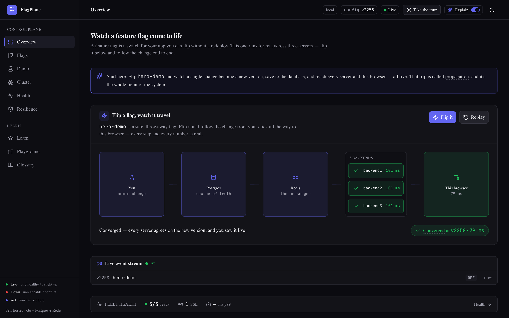
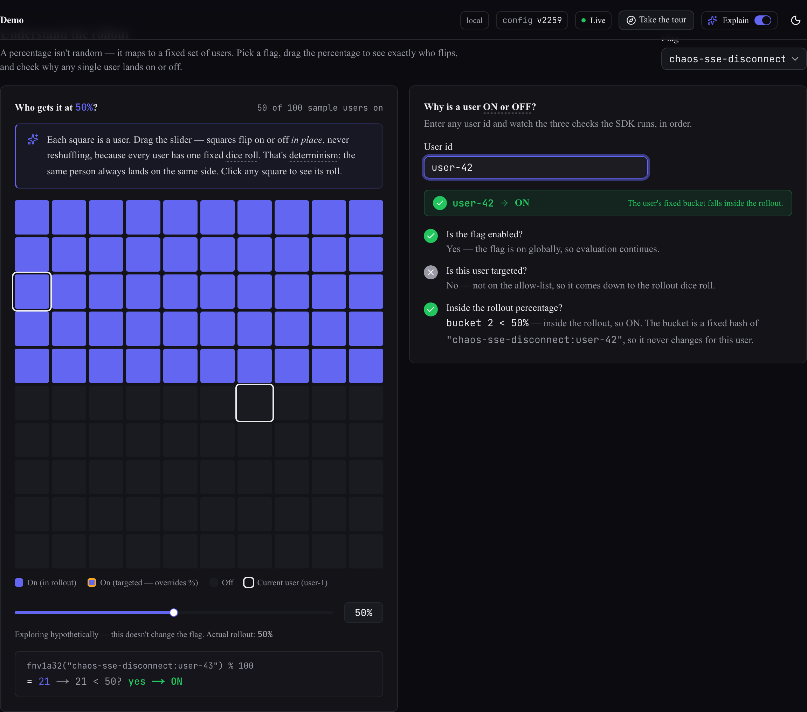
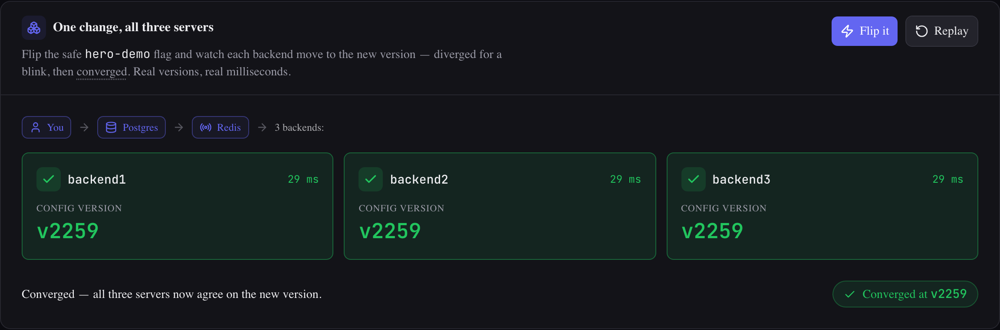
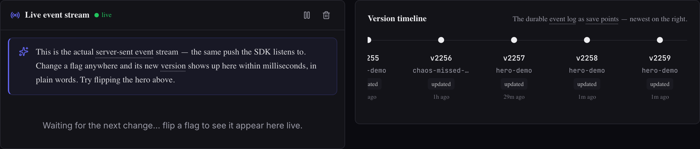
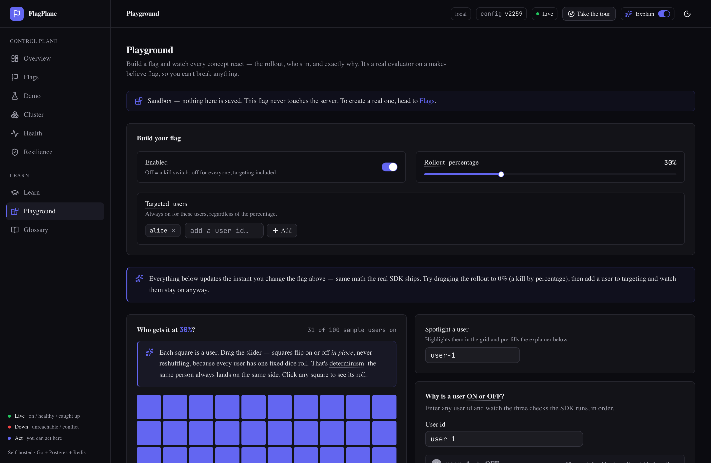

# FlagPlane — a self-hosted feature flag platform

[](https://go.dev/)
[](https://www.typescriptlang.org/)
[](https://www.postgresql.org/)
[](https://redis.io/)
[](https://www.docker.com/)
[](LICENSE)

A self-hosted feature flag platform with percentage rollouts, targeted users, and
real-time propagation — from API to dashboard to client SDK. Built for
**correctness and scale** (versioned config with optimistic concurrency,
cross-instance propagation across a 3-node cluster, gap-free client reconciliation,
a full observability stack, and chaos-proven resilience) — and wrapped in a
**self-explaining dashboard** that teaches feature-flag best practices *while you
use it*.

<p align="center">
  
</p>

<p align="center">
  <a href="https://github.com/kripa-sindhu-007/feature-flag-system/raw/main/video/out/demo-video.mp4"><b>▶ Watch the 2-minute demo</b></a>
</p>

> Every number in the UI is real. Flip `hero-demo` on the Overview and watch a
> single change become a new version, commit to Postgres, fan out through Redis,
> reach all three backends, and land in your browser — **converged at v2258 in 79 ms**,
> measured end to end.

---

## Table of contents

- [Why this exists](#why-this-exists)
- [Feature-flag best practices — and how FlagPlane implements them](#feature-flag-best-practices--and-how-flagplane-implements-them)
- [A dashboard that explains itself](#a-dashboard-that-explains-itself)
- [Architecture](#architecture)
- [Key features](#key-features)
- [Tech stack](#tech-stack)
- [Getting started](#getting-started)
- [API reference](#api-reference)
- [Observability](#observability)
- [Reliability (chaos & soak)](#reliability-chaos--soak)
- [Benchmarks](#benchmarks-measured)
- [Project structure](#project-structure)
- [Design decisions](#design-decisions)

---

## Why this exists

Commercial feature-flag services (LaunchDarkly, Flagsmith) solve a real problem,
but they're expensive at scale and their evaluation logic is a black box. FlagPlane
is a fully transparent, self-hosted alternative built from scratch — every layer,
from the FNV-1a hashing to the SSE broker to the Redis fan-out, is visible and
auditable. It was also a deliberate deep-dive into real-time distributed systems
with Go, PostgreSQL, and Redis — and into making that system **legible**: a
newcomer can land on the dashboard and understand percentage rollouts, propagation,
and convergence within a minute, without prior knowledge.

---

## Feature-flag best practices — and how FlagPlane implements them

Feature flags are easy to add and easy to misuse. FlagPlane is built around the
practices that keep them safe in production — and every one is demonstrable in the
running app.

| Best practice | Why it matters | How FlagPlane implements it | See it |
|---|---|---|---|
| **Decouple deploy from release** | Ship code dark, turn it on later, roll back instantly — no redeploy. | Global `enabled` toggle + per-flag rollout, applied live over SSE. | Overview hero · Flags |
| **Roll out gradually** | Limit blast radius: 1% → 10% → 100%, watch, then ramp. | Percentage rollouts with a monotonic ramp — raising the % only *adds* users, never drops existing ones. | Demo · Playground |
| **Make evaluation deterministic** | The same user must get the same answer every request — no flicker. | `fnv1a("flagKey:userId") % 100`, identical in the Go server, the TS SDK, and the Go SDK (shared golden vector). | Demo → rollout visualizer |
| **Keep a kill switch** | Turn a bad feature off in seconds, for everyone. | `enabled:false` short-circuits evaluation everywhere, propagated in milliseconds. | Flags · Playground |
| **Target before you ramp** | Dogfood with staff/beta users before any percentage. | An always-on `targeted_users` allow-list, checked *before* the rollout. | Demo → "Why ON/OFF?" |
| **Evaluate locally** | No per-request network hop; works offline; predictable latency. | SDKs fetch config once and evaluate on-device (~13.5 ns/eval); stay fresh via SSE. | Demo · SDKs |
| **Version every change & edit safely** | Concurrent edits must not silently clobber each other; you need an audit trail. | Monotonic config version + per-flag version, `If-Match` optimistic writes (`409` on conflict), and a durable `flag_events` log. | Flags → history · Cluster → timeline |
| **Propagate in real time, degrade gracefully** | Changes should reach every server fast — and survive an outage. | Redis fan-out to every replica's SSE broker; clients reconcile missed events from the durable log; last-known-good on failure (never regress). | Cluster · Resilience |
| **Observe your flags** | Know a change actually reached everyone, and how long it took. | Prometheus metrics (propagation p50/p95/p99, SSE clients), Grafana, real `/readyz`. | Health · Grafana |
| **Fail safe** | The source of truth must survive the cache. | Postgres commits first; Redis is best-effort; a downed node drains at the LB via `/readyz`. | Resilience |
| **Keep admin secrets server-side** | Admin keys must never ship to the browser. | A Next.js BFF proxy holds `ADMIN_API_KEY` server-side; the client calls same-origin `/api/admin/*`. | (architecture) |
| **Be honest about guarantees** | Overclaiming "HA / strongly consistent" is how outages happen. | Documented as *eventual convergence with bounded, measured latency and a durable source of truth* — **not** HA, **not** strong consistency. | [docs/LIMITATIONS.md](docs/LIMITATIONS.md) |

---

## A dashboard that explains itself

The admin dashboard is also a teaching tool. It leads with plain English, keeps the
dense operator view one click away (an **Explain** toggle), and turns every hard
concept into something you can *watch happen* with real data — never mocked.

### Evaluation, made visible

Drag a rollout percentage and watch exactly **which** users flip — in place, never
reshuffling, because each user's bucket is a fixed hash. Click any user to see the
real `fnv1a32("flag:user") % 100` roll, or ask **"why is this user ON or OFF?"** and
get the SDK's exact three-step verdict.

<p align="center">
  
</p>

### The distributed system, made watchable

Flip a flag and watch all three backends move to the new version — **diverged for a
blink, then converged** — with real per-node milliseconds. A human-readable live
event stream and a version timeline turn the raw SSE frames and the durable event
log into plain language.

<p align="center">
  
</p>

<p align="center">
  
</p>

### A safe place to learn by doing

A **Playground** lets you build a flag and watch every concept react — with nothing
saved and nothing to break. There's also a first-run guided tour, a **Learn** index
of concept cards, and an inline glossary behind every dotted term.

<p align="center">
  
</p>

> This teaching layer shipped as a four-part initiative (explanation layer → rollout
> visualizer → distributed visibility → guided experience). It's presentation-only:
> every element reflects the real running system.

---

## Architecture

Production traffic enters through an **nginx load balancer** that fans out across
**three identical Go backend replicas**. Every write commits to PostgreSQL with a
monotonic config version, then publishes to **Redis**; each replica runs a Redis
**subscriber** that fans the change out to its own SSE clients — so a change made on
any node reaches clients connected to *every* node. Prometheus scrapes all three
replicas, Grafana visualizes them, and an OpenTelemetry collector receives the
exemplar propagation trace.

```
   Clients / SDKs (browser TS + Go)        Admin Dashboard (Next.js :3000)
        │  REST + SSE                              │  REST + SSE (+ BFF admin proxy)
        ▼                                          ▼
   ┌───────────────────────────── nginx LB (:8080) ─────────────────────────────┐
   │                    round-robin REST · sticky SSE streams                    │
   └───────────┬───────────────────────┬───────────────────────┬────────────────┘
               ▼                        ▼                        ▼
        ┌────────────┐           ┌────────────┐           ┌────────────┐
        │ backend1   │           │ backend2   │           │ backend3   │   Go API
        │ :8081      │           │ :8082      │           │ :8083      │   (Chi)
        │ Handlers   │           │ Handlers   │           │ Handlers   │
        │ Service    │           │ Service    │           │ Service    │
        │ SSE Broker │           │ SSE Broker │           │ SSE Broker │
        │ Redis Sub  │           │ Redis Sub  │           │ Redis Sub  │
        └─────┬──────┘           └─────┬──────┘           └─────┬──────┘
              │  publish/subscribe      │                        │
              ├─────────────────────────┴────────────┬───────────┤
              ▼                                        ▼           ▼
        ┌──────────┐                             ┌──────────┐  /metrics scraped by
        │  Redis   │  flag_updates pub/sub bus   │PostgreSQL│  ┌──────────────────┐
        │          │  (versioned envelopes)      │ flags +  │  │ Prometheus :9090 │
        └──────────┘                             │ events   │  │ Grafana    :3001 │
                                                 └──────────┘  │ OTEL coll. :4318 │
                                                               └──────────────────┘
```

> The single-node picture still works too (`NODE_ID`, one Postgres, one Redis). The
> three-replica topology is what proves cross-instance propagation is real rather
> than in-process only.

---

## Key features

- **Boolean and percentage rollouts** — simple on/off, or gradual rollouts via
  deterministic FNV-1a hashing, so a user always gets a consistent result.
- **Targeted user overrides** — enable a feature for specific user IDs regardless of
  the rollout percentage, for internal testing or beta access.
- **Versioned config + optimistic concurrency** — every mutation bumps a monotonic
  global config version and a per-flag version, appends to a durable `flag_events`
  log, and supports `If-Match` conditional writes (`409` on a stale update) — so
  concurrent writers never silently lose changes.
- **Cross-instance real-time propagation** — changes publish a versioned envelope to
  Redis; every replica subscribes and fans it out to its own SSE clients. Verified
  on a 3-replica cluster.
- **Automatic client reconciliation** — SSE frames carry the config version as the
  event `id`. Clients detect gaps and replay them in order via
  `GET /api/client/events?since=V`, converging to the exact latest state.
- **Two SDKs, local evaluation** — a browser **TypeScript SDK** and a server-side
  **Go SDK** each fetch config once, evaluate locally with identical FNV-1a hashing,
  and stay in sync via SSE + reconcile. The Go SDK doubles as the load/chaos driver.
- **Multi-instance cluster** — three Go replicas behind nginx, with advisory-locked
  boot migrations so replicas start safely against a shared database.
- **Observability & operations** — Prometheus `/metrics`, a provisioned Grafana
  dashboard, an OpenTelemetry exemplar trace, structured JSON logging with request
  IDs, real `/readyz` readiness, and graceful SSE-draining shutdown on `SIGTERM`.
- **Chaos-proven resilience** — scripted node/Redis/Postgres/SSE failures that each
  assert an invariant, plus a soak runner ([docs/CHAOS.md](docs/CHAOS.md)).
- **Self-explaining dashboard** — an explanation-first UI with an Explain toggle,
  interactive rollout visualizer and "why ON/OFF?" explainer, live event stream and
  version timeline, a guided tour, a Learn index, a safe Playground, and an inline
  glossary. Built with Next.js, React Query, and shadcn/ui.
- **Security hardening** — the admin key is held server-side via a Next.js BFF proxy
  and never ships to the browser bundle.
- **One-command setup** — `docker compose up` starts the whole stack.

---

## Tech stack

| Layer          | Technology                                          |
|----------------|-----------------------------------------------------|
| API server     | Go 1.22, Chi router, net/http SSE, `log/slog`       |
| Database       | PostgreSQL 16 (pgx driver, UUID keys, event log)    |
| Cache / pub-sub| Redis 7 (go-redis, `flag_updates` channel)          |
| Load balancer  | nginx (round-robin REST, long-lived SSE streams)    |
| Frontend       | Next.js 16, React 19, TypeScript 5                  |
| UI             | shadcn/ui, Tailwind CSS v4, React Query v5           |
| SDKs           | TypeScript (browser) + Go (server-side), shared FNV-1a |
| Observability  | Prometheus, Grafana, OpenTelemetry (OTLP)           |
| Infrastructure | Docker Compose (3 backend replicas + LB + observability) |

---

## Getting started

### Prerequisites

- [Docker](https://docs.docker.com/get-docker/) and Docker Compose
- (Optional) Go 1.22+ and Node.js 20+ for local development

### Run the full stack

```bash
git clone https://github.com/kripa-sindhu-007/feature-flag-system.git
cd feature-flag-system
docker compose up --build
```

| Service            | URL / address              | Notes                                              |
|--------------------|----------------------------|----------------------------------------------------|
| Dashboard          | http://localhost:3000      | Overview, Flags, Demo, Cluster, Health, Resilience, **Learn**, **Playground**, Glossary |
| API (via nginx LB) | http://localhost:8080      | Production entrypoint, round-robins backends       |
| Backend replicas   | :8081 / :8082 / :8083      | Individual nodes (per-node `/readyz`, `/metrics`)  |
| Prometheus         | http://localhost:9090      | Scrapes all three backends                         |
| Grafana            | http://localhost:3001      | Provisioned "Feature Flags — Observability" dashboard |
| OTEL collector     | localhost:4318 / :4317     | Receives the exemplar propagation trace            |
| PostgreSQL         | localhost:5432             | Flag storage + event log                           |
| Redis              | localhost:6379             | `flag_updates` pub/sub bus                         |

> **New here?** Open http://localhost:3000, take the 60-second guided tour, then
> flip `hero-demo` on the Overview.

Admin calls use `X-Admin-API-Key: admin-secret-key`; client calls use
`X-SDK-Key: sdk-secret-key` (or `?key=` for SSE). Both default keys are for local
dev only — override via environment variables in production.

### Create your first flag

```bash
curl -X POST http://localhost:8080/api/admin/flags \
  -H "Content-Type: application/json" \
  -H "X-Admin-API-Key: admin-secret-key" \
  -d '{
    "key": "new-checkout-flow",
    "description": "Redesigned checkout experience",
    "enabled": true,
    "rollout_percentage": 25,
    "targeted_users": ["user-1", "user-3"]
  }'
```

The flag appears on the dashboard in real time.

---

## API reference

Admin endpoints require `X-Admin-API-Key`. Client endpoints require `X-SDK-Key`
(or `?key=` for SSE). Operational endpoints are unauthenticated.

### Admin

| Method   | Endpoint                       | Description                                              |
|----------|--------------------------------|---------------------------------------------------------|
| `POST`   | `/api/admin/flags`             | Create a flag                                           |
| `GET`    | `/api/admin/flags`             | List all flags                                          |
| `GET`    | `/api/admin/flags/{id}`        | Get a flag by ID                                        |
| `GET`    | `/api/admin/flags/{id}/events` | Version history for a flag (from the durable event log) |
| `PUT`    | `/api/admin/flags/{id}`        | Update — send `If-Match: <version>` for an optimistic write (`409` on conflict) |
| `DELETE` | `/api/admin/flags/{id}`        | Delete a flag                                           |
| `PATCH`  | `/api/admin/flags/{id}/toggle` | Atomically toggle a flag on/off                         |

### Client

| Method | Endpoint                        | Description                                               |
|--------|---------------------------------|----------------------------------------------------------|
| `GET`  | `/api/client/flags`             | Fetch all flag configs (+ current config version)        |
| `GET`  | `/api/client/stream`            | SSE stream (frames carry `id: <version>`)                |
| `GET`  | `/api/client/events?since=V`    | Ordered events after version `V` — used to reconcile after a gap |
| `GET`  | `/api/client/version`           | This node's `{node_id, config_version, sse_clients}`     |

### Operational

| Method | Endpoint    | Description                                                             |
|--------|-------------|------------------------------------------------------------------------|
| `GET`  | `/healthz`  | Liveness — `200` while the process is up (no dependency checks)         |
| `GET`  | `/readyz`   | Readiness — `200` only when Postgres **and** Redis are reachable, else `503` (the LB drains the node) |
| `GET`  | `/metrics`  | Prometheus metrics                                                     |

### Evaluate a flag in the SDK

```typescript
import { FeatureFlagClient } from './sdk/FeatureFlagClient';

const client = new FeatureFlagClient({
  baseUrl: 'http://localhost:8080',
  sdkKey: 'sdk-secret-key',
});
await client.init();

if (client.isEnabled('new-checkout-flow', 'user-42')) {
  // Show the new checkout
}
```

The **Go server-side SDK** ([`backend/pkg/ffclient`](backend/pkg/ffclient)) speaks the
same protocol — bootstrap, SSE stream, local FNV-1a evaluation, version tracking,
paged reconcile — and doubles as the load/chaos driver.

```go
ctx, cancel := context.WithCancel(context.Background())
defer cancel() // cancelling ctx stops the SSE stream

client := ffclient.New(ffclient.Config{
    BaseURL: "http://localhost:8080",
    SDKKey:  "sdk-secret-key",
})
if err := client.Start(ctx); err != nil { // bootstrap + live SSE + reconcile
    log.Fatal(err)
}

if client.IsEnabled("new-checkout-flow", "user-42") {
    // Show the new checkout
}
```

### Flag evaluation logic

The SDK and server evaluate in the same order:

1. **Disabled** — if `enabled` is `false`, return `false` (a global kill switch).
2. **Targeted** — if the user ID is in `targeted_users`, return `true`.
3. **Rollout** — compute `fnv1a("flagKey:userId") % 100`; return `true` if it's less
   than `rollout_percentage`.

---

## Observability

Every metric measures a real server-side event — nothing is faked. (Flag
*evaluation* happens client-side in the SDK, so there is deliberately no server-side
evaluation counter.)

| Metric                          | Type      | What it measures                                   |
|---------------------------------|-----------|----------------------------------------------------|
| `flag_updates_total{type}`      | counter   | Mutations published, by kind (created/updated/deleted/toggled) |
| `config_propagation_seconds`    | histogram | Publish→consume propagation latency on the receiving node |
| `sse_connected_clients`         | gauge     | Live SSE clients on this node                       |
| `redis_publish_errors_total`    | counter   | Failed Redis publishes                              |
| `db_query_seconds{query}`       | histogram | Repository query latency, by query                 |
| `reconciliation_seconds`        | histogram | Duration of `events?since=` reconcile requests      |

- **Dashboards** — Grafana at http://localhost:3001 ships a provisioned dashboard
  (propagation p50/p95/p99, SSE clients per node, update/error rates, DB latency).
- **In-app** — the **Health** view shows per-node readiness, live SSE clients, and
  propagation p99 from Prometheus; the **Cluster** view shows each node's version and
  convergence.
- **Tracing** — set `OTEL_EXPORTER_OTLP_ENDPOINT` to emit the exemplar
  `flag.propagate → redis.publish → sse.broadcast` span; trace context rides the
  Redis envelope so it stitches across nodes. Unset = tracing off.
- **Logging** — structured JSON (`log/slog`) with a request ID on every request and
  the flag key + version on every mutation.
- **Graceful shutdown** — on `SIGTERM` the server stops accepting, drains in-flight
  SSE streams, stops the Redis subscriber, and closes connections within a timeout.

---

## Reliability (chaos & soak)

Reliability is *proven*, not asserted. Reproducible chaos scripts under
[`chaos/`](chaos) inject real faults into the running cluster — backend crash, Redis
down, Postgres down, SSE disconnect, missed events, concurrent writers — and each
**asserts its invariant** (version monotonicity, convergence, durability,
no-corruption) and exits non-zero on any violation. A soak runner drives a
continuous mixed workload with an online invariant checker.

- All six chaos scenarios pass; a 22-minute soak (40+6 clients, 302k evals, 829
  reconnects) ran with **zero invariant violations**.
- Chaos testing surfaced and fixed a real gap — nginx's default 60s
  `proxy_connect_timeout` stalled the LB when a node died (now bounded + fails over).
- Full method, results, honest findings: **[docs/CHAOS.md](docs/CHAOS.md)**.
- Guarantees, decisions, and known limitations: **[docs/LIMITATIONS.md](docs/LIMITATIONS.md)**.

```bash
chaos/run-all.sh                      # whole matrix, PASS/FAIL summary
cd backend && go run ./cmd/soak -duration 22m -clients 40 -churn 6
```

---

## Benchmarks (measured)

Real numbers from the Go-SDK load driver ([`backend/cmd/loadgen`](backend/cmd/loadgen))
against the running 3-node cluster on an **Apple M5 (10 cores, 16 GB)** laptop —
single-host `docker compose`, so everything shares one machine. Measured, never
extrapolated. Full methodology: **[docs/BENCHMARKS.md](docs/BENCHMARKS.md)**.

- **Propagation p50 ≈ 3–17 ms, p99 ≈ 13–33 ms** end to end (admin commit → Redis →
  SSE fan-out → client applied) from **100 up to 2 000** connected SSE clients, all at
  **100 % delivery**; still 100 % at **5 000** clients (p50 ≈ 36 ms, p99 ≈ 192 ms).
- **Local evaluation ≈ 74 M evals/sec single-core** (~13.5 ns/eval — pure CPU FNV-1a
  + map lookup, zero network).
- **≈ 85 KB heap + ~4 goroutines per connected client** (client-side).
- **Ceiling ≈ 5 000 SSE clients** on this single host — bounded by host CPU with the
  harness co-resident (nginx tuned to `worker_connections 16384`, so not the limit).
  Past ~8 000, delivery slips below 100 % and p99 explodes. Stated honestly, not hidden.

```bash
cd backend
go run ./cmd/loadgen -mode propagation -clients 200 -updates 20 -eval-rate 10
go run ./cmd/loadgen -mode eval -eval-duration 8s -eval-workers 1
```

---

## Project structure

```
feature-flag-system/
├── backend/
│   ├── cmd/
│   │   ├── server/              # API server entry (wiring + graceful shutdown)
│   │   ├── loadgen/             # Load harness / benchmark driver (Go SDK fleet)
│   │   ├── chaos/               # Chaos invariant asserter
│   │   └── soak/                # Soak runner with online invariant checker
│   ├── internal/
│   │   ├── config/              # Environment variable loading
│   │   ├── handler/             # HTTP handlers (admin, client, health)
│   │   ├── hash/                # FNV-1a consistent hashing
│   │   ├── metrics/             # Prometheus instrumentation + /metrics
│   │   ├── middleware/          # Auth, CORS, structured request logging
│   │   ├── migrate/             # Advisory-locked, ordered migration runner
│   │   ├── model/               # Flag + event structs and request types
│   │   ├── repository/          # PostgreSQL data access (versioned writes)
│   │   ├── service/             # Business logic, validation, publish
│   │   ├── sse/                 # SSE broker + Redis pub/sub wire protocol
│   │   └── tracing/             # OpenTelemetry init (no-op unless configured)
│   ├── migrations/              # SQL schema migrations (flags + versioning/events)
│   └── pkg/
│       ├── ffclient/            # Go server-side SDK (also the load/chaos driver)
│       └── chaoskit/            # Chaos assertion helpers
├── frontend/
│   ├── app/                     # Next.js routes: overview, flags, demo, cluster,
│   │   │                        #   health, resilience, learn, playground, glossary
│   │   └── api/admin/           # BFF proxy — holds the admin key server-side
│   ├── components/
│   │   ├── explain/             # Teaching layer: GuidedTour, Explain toggle, Term,
│   │   │                        #   RolloutVisualizer, WhyExplainer, SseConsole,
│   │   │                        #   VersionTimeline, glossary primitives
│   │   ├── overview/            # PropagationHero
│   │   ├── cluster/             # ClusterHero
│   │   └── layout/              # App shell (sidebar, top bar)
│   ├── hooks/                   # React Query hooks (flags, SSE, cluster, health, events)
│   ├── lib/                     # evaluate.ts (SDK-parity eval trace), glossary, admin-proxy
│   ├── sdk/                     # Browser TypeScript client SDK
│   └── design-system/           # MASTER.md — design tokens & UI spec
├── infra/                       # nginx, prometheus, otel-collector, grafana provisioning
├── chaos/                       # Fault-injection scripts + run-all.sh
├── docs/                        # BENCHMARKS.md, CHAOS.md, LIMITATIONS.md, UX_ROADMAP.md, screenshots
└── docker-compose.yml           # Full stack: 3 backends + LB + observability
```

---

## Design decisions

- **SSE over WebSockets** — flag updates are one-way (server → client), so SSE fits:
  plain HTTP, proxy/LB-friendly, auto-reconnecting `EventSource`. WebSockets would add
  bidirectional complexity for a one-way problem.
- **Redis as a pub/sub layer in front of Postgres** — Postgres is the source of truth;
  Redis's `flag_updates` channel decouples the write path from the notification path
  and enables horizontal scaling with no shared in-memory state.
- **Deterministic hashing for rollouts** — `fnv1a("flagKey:userId") % 100` guarantees a
  user always lands in the same bucket; ramping the percentage adds users without
  dropping anyone. Identical on the Go server and both SDKs (shared golden vector).
- **Config versioning + optimistic concurrency** — a monotonic sequence versions every
  mutation; `If-Match` makes updates conditional (`409` on stale writes); a durable
  `flag_events` log makes gap-free client reconciliation possible.
- **Cross-instance propagation via a Redis subscriber** — each replica runs a subscriber
  that fans changes to its own SSE clients; the publisher delivers through the same path,
  so all nodes follow one uniform code path — genuinely horizontal, not single-node in disguise.
- **Version-tagged SSE + reconcile over Last-Event-ID replay** — each SSE frame's `id` is
  the config version; a client that sees a gap replays `events?since=V`. Correctness
  doesn't depend on the transport being lossless — the durable log is the backstop.
- **Readiness distinct from liveness** — `/healthz` answers while the process runs;
  `/readyz` fails when a dependency is down so the LB drains the node without a restart storm.
- **Admin key server-side (BFF proxy)** — the browser calls same-origin `/api/admin/*`;
  the Next.js server attaches the admin key, so it never enters the client bundle.
- **A self-explaining UI via progressive disclosure** — one interface, teaching by
  default, dense operator view one Explain-toggle away — no parallel designs to maintain.

---

## License

Licensed under the [MIT License](LICENSE).
