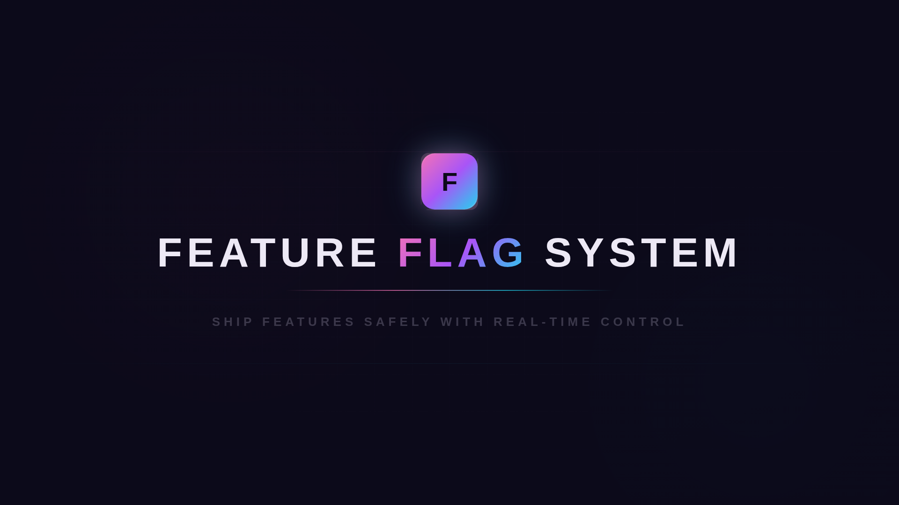

# Feature Flag System

[](https://go.dev/)
[](https://www.typescriptlang.org/)
[](https://www.postgresql.org/)
[](https://redis.io/)
[](https://www.docker.com/)
[](LICENSE)

A self-hosted feature flag platform with percentage rollouts, targeted user access, and real-time propagation — from API to dashboard to client SDK. Built for correctness and scale: versioned configuration with optimistic concurrency, cross-instance propagation across a multi-node cluster, automatic client reconciliation after disconnects, and a full observability stack (Prometheus, Grafana, OpenTelemetry) with measured benchmarks.

---

## Demo

[](https://github.com/kripa-sindhu-007/feature-flag-system/raw/main/video/out/demo-video.mp4)

> **Click the image above to watch the demo** — a 2-minute walkthrough covering flag creation, percentage rollouts, real-time toggling, and the demo app showing per-user evaluation across different rollout rules.

---

## Why This Exists

Commercial feature flag services like LaunchDarkly and Flagsmith solve a real problem, but they're expensive at scale and their evaluation logic is a black box. This project is a self-hosted, fully transparent alternative built from scratch — every layer from the hashing algorithm to the SSE broker is visible and auditable. It also served as a deep dive into building real-time distributed systems with Go, PostgreSQL, and Redis.

---

## Architecture

Production traffic enters through an **nginx load balancer** that fans out across
**three identical Go backend replicas**. Every write is committed to PostgreSQL
with a monotonic config version, then published to **Redis**; each replica runs a
Redis **subscriber** that fans the change out to its own SSE clients — so a change
made on any node reaches clients connected to *every* node. Prometheus scrapes all
three replicas, Grafana visualizes them, and an OpenTelemetry collector receives
the exemplar propagation trace.

```
   Clients / SDKs (browser TS + Go)        Admin Dashboard (Next.js :3000)
        │  REST + SSE                              │  REST + SSE
        ▼                                          ▼
   ┌───────────────────────────── nginx LB (:8080) ─────────────────────────────┐
   │                    round-robin REST · sticky SSE streams                    │
   └───────────┬───────────────────────┬───────────────────────┬────────────────┘
               ▼                        ▼                        ▼
        ┌────────────┐           ┌────────────┐           ┌────────────┐
        │ backend1   │           │ backend2   │           │ backend3   │   Go API
        │ :8081      │           │ :8082      │           │ :8083      │   (Chi)
        │ Handlers   │           │ Handlers   │           │ Handlers   │
        │ Service    │           │ Service    │           │ Service    │
        │ SSE Broker │           │ SSE Broker │           │ SSE Broker │
        │ Redis Sub  │           │ Redis Sub  │           │ Redis Sub  │
        └─────┬──────┘           └─────┬──────┘           └─────┬──────┘
              │  publish/subscribe      │                        │
              ├─────────────────────────┴────────────┬───────────┤
              ▼                                        ▼           ▼
        ┌──────────┐                             ┌──────────┐  /metrics scraped by
        │  Redis   │  flag_updates pub/sub bus   │PostgreSQL│  ┌──────────────────┐
        │          │  (versioned envelopes)      │ flags +  │  │ Prometheus :9090 │
        └──────────┘                             │ events   │  │ Grafana    :3001 │
                                                 └──────────┘  │ OTEL coll. :4318 │
                                                               └──────────────────┘
```

> The single-node picture still works too: `NODE_ID`, one Postgres, one Redis.
> The three-replica topology is what proves cross-instance propagation is real
> rather than in-process only.

---

## Key Features

- **Boolean and percentage-based rollouts** — Flags support simple on/off toggles or gradual rollouts using deterministic FNV-1a hashing, so the same user always gets a consistent result for a given flag.
- **Targeted user overrides** — Enable a feature for specific user IDs regardless of the rollout percentage, useful for internal testing or beta access.
- **Versioned configuration with optimistic concurrency** — Every mutation bumps a monotonic global config version and a per-flag version, appends to a durable `flag_events` log, and supports `If-Match` conditional writes that return `409 Conflict` on a stale update — so concurrent writers never silently lose changes.
- **Cross-instance real-time propagation** — Flag changes publish a versioned envelope to Redis; every backend replica subscribes and fans it out to its own SSE clients. A change on any node reaches clients on all nodes, verified on a 3-replica cluster.
- **Automatic client reconciliation** — SSE frames carry the config version as the event `id`. Clients detect gaps (missed events, reconnects) and replay them in order via `GET /api/client/events?since=V`, converging to the exact latest state — no lost or stale flags after a disconnect.
- **Two SDKs, local evaluation** — A **browser TypeScript SDK** and a **Go server-side SDK** each fetch configs once, evaluate rules locally (zero network latency per check) with identical FNV-1a hashing, and stay in sync via SSE + reconcile.
- **Multi-instance cluster** — Three Go replicas behind an nginx load balancer, with advisory-locked boot migrations so replicas start safely against a shared database.
- **Observability & operations** — Prometheus metrics (`/metrics`), a provisioned Grafana dashboard, an OpenTelemetry exemplar trace, structured JSON logging with request IDs, real `/readyz` readiness (drains a node at the LB when a dependency is down), and graceful shutdown that drains in-flight SSE streams on `SIGTERM`.
- **Measured benchmarks** — A Go load harness drives thousands of concurrent SSE clients and reports real propagation and evaluation numbers (see [Benchmarks](#benchmarks-measured)).
- **Admin dashboard** — Create, edit, toggle, and delete flags, plus live **Cluster** and **Health** views, from a responsive Next.js UI (React Query, shadcn/ui).
- **Docker Compose one-command setup** — `docker compose up` starts the entire stack: three Go replicas + nginx LB, Next.js frontend, PostgreSQL, Redis, Prometheus, Grafana, and the OpenTelemetry collector.

---

## Tech Stack

| Layer          | Technology                                          |
|----------------|-----------------------------------------------------|
| API Server     | Go 1.22, Chi router, net/http SSE, `log/slog`       |
| Database       | PostgreSQL 16 (pgx driver, UUID keys, event log)    |
| Cache / Pub-Sub| Redis 7 (go-redis, `flag_updates` channel)          |
| Load balancer  | nginx (round-robin REST, long-lived SSE streams)    |
| Frontend       | Next.js 16, React 19, TypeScript 5                  |
| UI Components  | shadcn/ui, TailwindCSS v4                            |
| State          | React Query v5 (cache invalidation via SSE)         |
| SDKs           | TypeScript (browser) + Go (server-side), shared FNV-1a |
| Observability  | Prometheus, Grafana, OpenTelemetry (OTLP)           |
| Infrastructure | Docker, Docker Compose (3 backend replicas + LB)    |

---

## Getting Started

### Prerequisites

- [Docker](https://docs.docker.com/get-docker/) and Docker Compose
- (Optional) Go 1.22+ and Node.js 20+ for local development

### Run the full stack

```bash
git clone https://github.com/kripa-sindhu-007/feature-flag-system.git
cd feature-flag-system
docker compose up --build
```

| Service              | URL / Address                 | Notes                                        |
|----------------------|-------------------------------|----------------------------------------------|
| Dashboard            | http://localhost:3000         | Flags, Demo, **Cluster**, **Health** views   |
| API (via nginx LB)   | http://localhost:8080         | Production entrypoint, round-robins backends |
| Backend replicas     | :8081 / :8082 / :8083         | Individual nodes (per-node `/readyz`, `/metrics`) |
| Prometheus           | http://localhost:9090         | Scrapes all three backends                   |
| Grafana              | http://localhost:3001         | Provisioned "Feature Flags — Observability" dashboard (anon viewer) |
| OTEL collector       | localhost:4318 / :4317        | Receives the exemplar propagation trace      |
| PostgreSQL           | localhost:5432                | Flag storage + event log                     |
| Redis                | localhost:6379                | `flag_updates` pub/sub bus                   |

Send `X-Admin-API-Key: admin-secret-key` for admin calls and `X-SDK-Key: sdk-secret-key`
(or `?key=`) for client calls. Both default keys are for local dev only — override via
environment variables in production.

### Create your first flag

```bash
curl -X POST http://localhost:8080/api/admin/flags \
  -H "Content-Type: application/json" \
  -H "X-Admin-API-Key: admin-secret-key" \
  -d '{
    "key": "new-checkout-flow",
    "description": "Redesigned checkout experience",
    "enabled": true,
    "rollout_percentage": 25,
    "targeted_users": ["user-1", "user-3"]
  }'
```

Open the dashboard at `http://localhost:3000` to see the flag appear in real time.

---

## API Reference

All admin endpoints require the `X-Admin-API-Key` header. Client endpoints require `X-SDK-Key` (or `?key=` query param for SSE). Operational endpoints are unauthenticated.

### Admin Endpoints

| Method   | Endpoint                       | Description                                              |
|----------|--------------------------------|---------------------------------------------------------|
| `POST`   | `/api/admin/flags`             | Create a new flag                                       |
| `GET`    | `/api/admin/flags`             | List all flags                                          |
| `GET`    | `/api/admin/flags/{id}`        | Get a flag by ID                                       |
| `GET`    | `/api/admin/flags/{id}/events` | Version history for a flag (from the durable event log) |
| `PUT`    | `/api/admin/flags/{id}`        | Update a flag — send `If-Match: <version>` for an optimistic write (`409` on conflict) |
| `DELETE` | `/api/admin/flags/{id}`        | Delete a flag                                           |
| `PATCH`  | `/api/admin/flags/{id}/toggle` | Atomically toggle a flag on or off                     |

### Client Endpoints

| Method | Endpoint                        | Description                                               |
|--------|---------------------------------|----------------------------------------------------------|
| `GET`  | `/api/client/flags`             | Fetch all flag configurations (+ current config version) |
| `GET`  | `/api/client/stream`            | SSE stream for real-time updates (frames carry `id: <version>`) |
| `GET`  | `/api/client/events?since=V`    | Ordered events after version `V` — used to reconcile after a gap |
| `GET`  | `/api/client/version`           | This node's `{node_id, config_version, sse_clients}`     |

### Operational Endpoints

| Method | Endpoint    | Description                                                             |
|--------|-------------|------------------------------------------------------------------------|
| `GET`  | `/healthz`  | Liveness — always `200` while the process is up (no dependency checks)  |
| `GET`  | `/readyz`   | Readiness — `200` only when Postgres **and** Redis are reachable, else `503` (the LB drains the node); reports this node's `config_version` |
| `GET`  | `/metrics`  | Prometheus metrics (see [Observability](#observability))               |

### Example: Evaluate a flag in the SDK

```typescript
import { FeatureFlagClient } from './sdk/FeatureFlagClient';

const client = new FeatureFlagClient({
  baseUrl: 'http://localhost:8080',
  sdkKey: 'sdk-secret-key',
});

await client.init();

if (client.isEnabled('new-checkout-flow', 'user-42')) {
  // Show the new checkout
}
```

The **Go server-side SDK** ([`backend/pkg/ffclient`](backend/pkg/ffclient)) speaks the
same protocol — bootstrap, SSE stream, local FNV-1a evaluation, version tracking, and
paged reconcile — and doubles as the load harness that drives the benchmarks below.

```go
ctx, cancel := context.WithCancel(context.Background())
defer cancel() // cancelling ctx stops the SSE stream

client := ffclient.New(ffclient.Config{
    BaseURL: "http://localhost:8080",
    SDKKey:  "sdk-secret-key",
})
if err := client.Start(ctx); err != nil { // bootstrap + live SSE + reconcile
    log.Fatal(err)
}

if client.IsEnabled("new-checkout-flow", "user-42") {
    // Show the new checkout
}
```

---

## Observability

Every metric measures a real server-side event — nothing is faked. (Flag *evaluation*
happens client-side in the SDK, so there is deliberately no server-side evaluation
counter.)

| Metric                          | Type          | What it measures                                   |
|---------------------------------|---------------|----------------------------------------------------|
| `flag_updates_total{type}`      | counter       | Mutations published, by kind (created/updated/deleted/toggled) |
| `config_propagation_seconds`    | histogram     | Publish→consume propagation latency on the receiving node |
| `sse_connected_clients`         | gauge         | Live SSE clients on this node                       |
| `redis_publish_errors_total`    | counter       | Failed Redis publishes                              |
| `db_query_seconds{query}`       | histogram     | Repository query latency, by query                 |
| `reconciliation_seconds`        | histogram     | Duration of `events?since=` reconcile requests      |

- **Dashboards** — Grafana at http://localhost:3001 ships a provisioned dashboard
  (propagation p50/p95/p99, SSE client count per node, update/error rates, DB latency).
  Prometheus scrapes every replica at http://localhost:9090.
- **In-app** — the dashboard's **Health** view shows per-node readiness, live SSE client
  count, and propagation p99 sourced from Prometheus; the **Cluster** view shows each
  node's config version and convergence.
- **Tracing** — set `OTEL_EXPORTER_OTLP_ENDPOINT` to emit the exemplar
  `flag.propagate → redis.publish → sse.broadcast` span; trace context rides the Redis
  envelope so it stitches together across nodes. Unset = tracing off, no collector needed.
- **Logging** — structured JSON (`log/slog`) with a request ID on every request and the
  flag key + version on every mutation.
- **Graceful shutdown** — on `SIGTERM` the server stops accepting, drains in-flight SSE
  streams, stops the Redis subscriber, and closes its connections within a bounded timeout.

---

## Project Structure

```
feature-flag-system/
├── backend/
│   ├── cmd/
│   │   ├── server/              # API server entry point (wiring + graceful shutdown)
│   │   └── loadgen/             # Load harness / benchmark driver (Go SDK fleet)
│   ├── internal/
│   │   ├── config/              # Environment variable loading
│   │   ├── handler/             # HTTP handlers (admin, client, health)
│   │   ├── hash/                # FNV-1a consistent hashing
│   │   ├── metrics/            # Prometheus instrumentation + /metrics
│   │   ├── middleware/          # Auth, CORS, structured request logging
│   │   ├── migrate/             # Advisory-locked, ordered migration runner
│   │   ├── model/               # Flag + event structs and request types
│   │   ├── repository/          # PostgreSQL data access (versioned writes)
│   │   ├── reqid/               # Request-ID context helpers
│   │   ├── service/             # Business logic, validation, publish
│   │   ├── sse/                 # SSE broker + Redis pub/sub wire protocol
│   │   └── tracing/             # OpenTelemetry init (no-op unless configured)
│   ├── migrations/              # SQL schema migrations (flags + versioning/events)
│   └── pkg/ffclient/            # Go server-side SDK (also the load driver)
├── frontend/
│   ├── app/                     # Next.js pages (overview, flags, demo, cluster, health)
│   ├── components/layout/       # App shell (sidebar, top bar)
│   ├── hooks/                   # React Query hooks (flags, SSE, cluster, health)
│   ├── sdk/                     # Browser TypeScript client SDK
│   └── design-system/           # MASTER.md — design tokens & UI spec
├── infra/
│   ├── nginx.conf               # Load balancer config
│   ├── prometheus.yml           # Scrape config
│   ├── otel-collector.yml       # OTLP receiver
│   └── grafana/                 # Provisioned datasource + dashboard
├── docs/                        # BENCHMARKS.md, demo assets
└── docker-compose.yml           # Full stack: 3 backends + LB + observability
```

---

## Design Decisions

### SSE over WebSockets for real-time updates

Feature flag updates are unidirectional — the server pushes changes to clients, and clients never need to send data back on the same channel. SSE is a natural fit: it's built on standard HTTP, works through proxies and load balancers without special configuration, and reconnects automatically via the browser's `EventSource` API. WebSockets would add bidirectional complexity for a problem that only requires one-way communication.

### Redis as a pub/sub layer in front of PostgreSQL

PostgreSQL is the source of truth for flag state, but broadcasting updates to connected SSE clients requires a pub/sub mechanism. Redis handles this with its `flag_updates` channel — when a flag changes, the service publishes an event to Redis, which fans out to any backend instance subscribed to the channel. This decouples the write path (Postgres) from the notification path (Redis) and sets the foundation for horizontal scaling without shared in-memory state.

### Percentage rollouts use deterministic hashing

Rollout percentages are evaluated by hashing `flagKey:userID` with FNV-1a and taking `hash % 100`. This guarantees that a given user always lands in the same bucket for the same flag — no database lookups, no random state. Increasing the rollout percentage from 25% to 50% adds new users without removing anyone already included. The hash function runs identically on the Go server and the TypeScript SDK, so evaluations are consistent regardless of where they happen.

### Config versioning + optimistic concurrency

A monotonic sequence assigns every mutation a global config version, and each flag carries its own version. Updates can be made conditional with `If-Match`, so two admins editing the same flag can't silently clobber each other — the stale write gets a `409`. Every change is also appended to a durable `flag_events` log, which is what makes gap-free client reconciliation possible.

### Cross-instance propagation via a Redis subscriber

The SSE broker is in-process, so a naive setup only reaches clients on the node that handled the write. Instead, every mutation publishes a versioned envelope to Redis, and **each replica runs a subscriber** that fans the change out to its own SSE clients. The publishing node delivers through the same subscriber path, so all nodes — publisher included — follow one uniform code path. This is why the system scales horizontally behind a load balancer instead of being single-node in disguise.

### Version-tagged SSE + reconcile over Last-Event-ID replay

Each SSE frame's `id` is the config version. A client that sees a gap (missed events during a disconnect, a dropped Redis message) calls `GET /api/client/events?since=V` and replays the ordered backlog until it converges. Correctness doesn't depend on the SSE transport being lossless — the durable event log is the backstop.

### Readiness distinct from liveness

`/healthz` answers as long as the process runs; `/readyz` fails when Postgres or Redis is unreachable so the load balancer drains that node without the orchestrator killing it. Pointing a liveness probe at a dependency check would turn a transient DB blip into a restart storm.

---

## Flag Evaluation Logic

The SDK and server evaluate flags in the same order:

1. **Flag disabled** — If `enabled` is `false`, return `false`
2. **Targeted user** — If the user ID is in `targeted_users`, return `true`
3. **Percentage rollout** — Compute `fnv1a("flagKey:userId") % 100`; return `true` if the result is less than `rollout_percentage`

---

## Benchmarks (measured)

Real numbers from the Go-SDK load driver ([`backend/cmd/loadgen`](backend/cmd/loadgen))
against the running 3-node cluster on an **Apple M5 (10 cores, 16 GB)** laptop —
single-host `docker compose`, so backends, Postgres, Redis, nginx and the harness
all share one machine. Measured, never extrapolated. Full methodology, tables and
the ceiling analysis: **[docs/BENCHMARKS.md](docs/BENCHMARKS.md)**.

- **Propagation p50 ≈ 3–17 ms, p99 ≈ 13–33 ms** end-to-end — admin commit →
  Redis → SSE fan-out → client applied — from **100 up to 2 000** connected SSE
  clients, all at **100 % delivery**; still 100 % delivery at **5 000** clients
  (p50 ≈ 36 ms, p99 ≈ 192 ms).
- **Local flag evaluation ≈ 74 M evals/sec single-core** (~13.5 ns/eval, pure
  CPU FNV-1a + map lookup, zero network).
- **≈ 85 KB heap + ~4 goroutines per connected client** (client-side).
- **Ceiling ≈ 5 000 SSE clients** on this single host — bounded by host CPU /
  scheduler saturation with the load harness co-resident (nginx is tuned to
  `worker_connections 16384`, so it's no longer the limit; the backends aren't
  either). Past ~8 000, delivery slips below 100 % and p99 explodes to ~1.9 s.
  Stated honestly rather than hidden.

Run them yourself:

```bash
cd backend
go run ./cmd/loadgen -mode propagation -clients 200 -updates 20 -eval-rate 10
go run ./cmd/loadgen -mode eval -eval-duration 8s -eval-workers 1
```

---

## Reliability (chaos & soak)

Reliability is *proven*, not asserted. Reproducible chaos scripts under
[`chaos/`](chaos) inject real faults into the running cluster — backend crash,
Redis down, Postgres down, SSE disconnect, missed events, concurrent writers —
and each **asserts its invariant** (version monotonicity, convergence, durability,
no-corruption) and exits non-zero on any violation. A soak runner drives a
continuous mixed workload with an online invariant checker.

- All six chaos scenarios pass; a 22-minute soak (40+6 clients, 302k evals, 829
  reconnects) ran with **zero invariant violations**.
- Chaos testing also surfaced and fixed a real resilience gap — nginx's default
  60s `proxy_connect_timeout` stalled the LB when a node died (now bounded + fails
  over to survivors).
- Full method, results and honest findings: **[docs/CHAOS.md](docs/CHAOS.md)**.
- Guarantees, key decisions, and known limitations: **[docs/LIMITATIONS.md](docs/LIMITATIONS.md)**.

```bash
chaos/run-all.sh                      # whole matrix, PASS/FAIL summary
cd backend && go run ./cmd/soak -duration 22m -clients 40 -churn 6
```

---

## Roadmap

**Delivered**

- [x] Versioned configuration, optimistic concurrency, and a durable event log
- [x] Cross-instance real-time propagation (Redis subscriber) across a 3-replica cluster
- [x] Gap-free client reconciliation after disconnects, for both the TS and Go SDKs
- [x] Observability — Prometheus metrics, Grafana dashboard, OpenTelemetry exemplar trace, structured logging
- [x] Real `/readyz` readiness, graceful SSE-draining shutdown, and a load harness with measured benchmarks
- [x] Chaos & soak testing — scripted node/Redis/Postgres failures with continuous invariant checks ([docs/CHAOS.md](docs/CHAOS.md))
- [x] Security hardening — admin key moved server-side via a Next.js BFF proxy (out of the browser bundle)

**Next**

- [ ] User auth + RBAC for the dashboard, and an audit log (who changed what, when)
- [ ] A/B testing with variant assignment and metric tracking
- [ ] Audit log for flag changes (who changed what, when)
- [ ] Published SDK packages (npm, Go module) for external integration
- [ ] Webhook integrations for flag change notifications to Slack, PagerDuty, etc.

---

## License

This project is licensed under the [MIT License](LICENSE).
